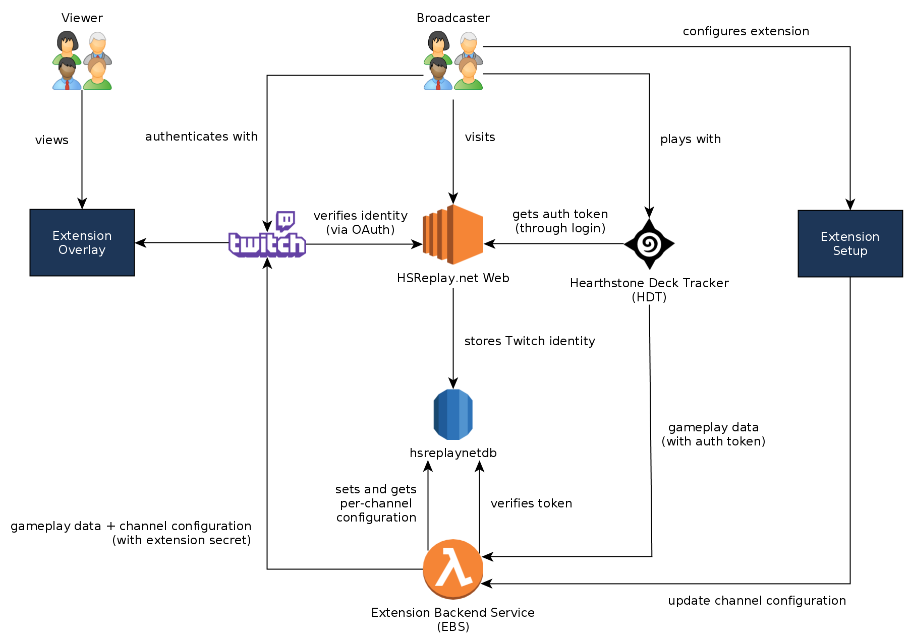

# Twitch Extension for Hearthstone Deck Tracker

This repository contains the official Twitch extension for Hearthstone Deck Tracker.

Follow the [setup guide](https://hsdecktracker.net/twitch/setup/) to add the extension to your channel.

## Features

- Twitch overlay extension for Hearthstone streams
- Automatic deck list and game state from Hearthstone Deck Tracker (Windows)
- Fully configurable by the broadcaster using the Twitch Dashboard
- Viewers can hover over minions, heroes, hero powers, weapons, secrets and quests
- Movable deck list with hoverable cards and "Copy Deck" button for viewers
- Card statistics panel powered by HSReplay.net
- High resolution card art

## Supported browsers

- Internet Explorer 11
- Last 2 Chrome versions
- Last 2 Firefox versions
- Safari 9

## Development

- Install dependencies: `yarn install`
- Run development server: `yarn dev`
- Release build: `yarn build`
- (Re)format code: `yarn format`
- Lint code: `yarn lint`

## How it works

## Testing

- Clone [twitch-ext-pubsub-simulator](https://github.com/HearthSim/twitch-ext-pubsub-simulator)
- Clone [hdt-twitch-test-data](https://github.com/HearthSim/hdt-twitch-test-data)
- Create an twitch extension in your account with types: `Video - FullScreen, Mobile`
- Make sure that Testing Base URI is `https://localhost:8080/` in Assets-Hosting tab
- Make sure that Video - Fullscreen Viewer Path is `viewer.html` in Assets-Hosting tab
- Enable the extension using the Test Extension on your channel option in Status tab
- In a live stream, request a fake board state using twitch-ext-pubsub-simulator/index.js using:
    - -f as `..\hdt-twitch-test-data\pubsub\v2\hdt-payload-dump-4.json`
    - --channel as your [userId](https://dev.twitch.tv/docs/v5/reference/users/#get-users)
    - --extension as the extension client id
    - --secret as the extension base64 secret

## Related projects

- [Hearthstone Deck Tracker](https://github.com/hearthsim/Hearthstone-Deck-Tracker): Tracks Hearthstone games and emits messages
- [HDT EBS (Extension Backend Service)](https://github.com/HearthSim/hdt-twitch-ebs): Verifies setup and relays game messages to the Twitch PubSub service

## License

Copyright © HearthSim - All Rights Reserved
